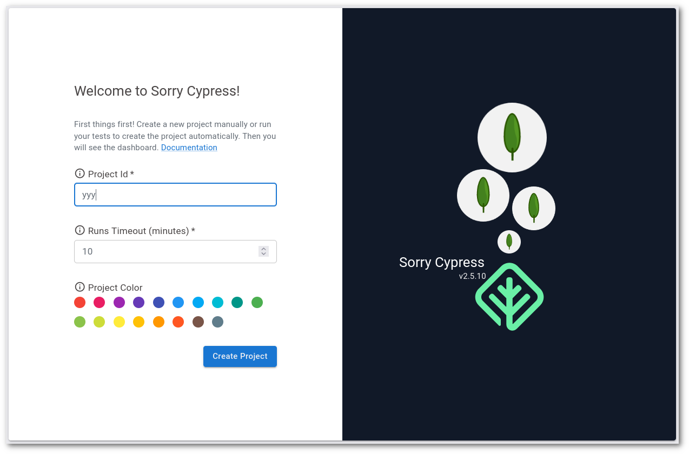
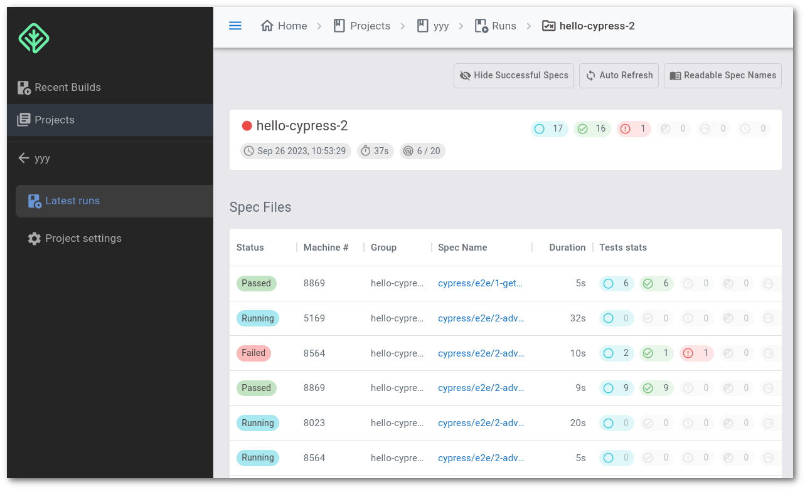

# Dashboard and API

The [basic](get-started.md) setup of sorry-cypress is already quite useful - we can run cypress tests in parallel without any limitations.

However, we want to store and see the test results and explore errors, screenshots and videos.

### Running sorry-cypress kit <a href="#persisting-test-results" id="persisting-test-results"></a>

We are going to run the full sorry-cypress kit:

1. `director` service will use MongoDB to store the test runs and the results
2. `API` service (a GraphQL interface to MongoDB) to let us issue queries and retrieve tests results
3. `Dashboard` service - a web dashboard for browsing the results
4. [`minio`](https://min.io/product/overview) will let us store files - videos and screenshots generated by cypress agent

We are going to run all the services locally using `docker-compose`

```bash
# get docker-compose file
curl --output docker-compose.minio.yml https://raw.githubusercontent.com/sorry-cypress/sorry-cypress/master/docker-compose.minio.yml

# start the services
docker-compose -f ./docker-compose.minio.yml up
```


* Make sure to install a modern version of [docker-compose](https://docs.docker.com/compose/install/)
* Shut down any stale sorry-cypress services with `docker kill`


After successfully running docker-compose, we have:

* `director` service on [http://localhost:1234](http://localhost:1234)
* `API` service on [http://localhost:4000](http://localhost:4000)
* `Dashboard` running on [http://localhost:8080](http://localhost:8080)

Open the dashboard at [http://localhost:8080](http://localhost:8080)

Create a project with the id you wrote as value for `projectId` in
your `currents.config.js` file (e.g., "yyy").



### Setup Screenshots Upload

We are using `minio` service to store files generated by cypress agents - video recordings and failed test screenshots. Each agent uploads the files directly to `minio` .

Edit your `/etc/hosts` file to allow cypress agents to discover the local instance of `minio`

```bash
127.0.0.1 storage
```

### Running cypress tests in parallel. <a href="#running-cypress-tests-in-parallel" id="running-cypress-tests-in-parallel"></a>

`director` is running in a Docker container, but it is still accessible at [`http://localhost:1234`](http://localhost:1234). We have already reconfigured `cypress` to use this URL. Let's just rerun the tests.

Open several terminal windows within a directory with tests and run `cypress` in each.

```bash
# run in each terminal
cypress-cloud run --parallel --record --key somekey --ci-build-id hello-cypress
```

As soon as agents start their execution, refresh the dashboard. You'd see a new project and a new run created.


Use the same `--ci-build-id` value to associate different cypress agents with the same run. Learn more about [CI Build ID.](https://currents.dev/readme/guides/cypress-ci-build-id)


### Exploring the dashboard

The dashboard is quite simple - go ahead and explore the tests you have just created.



Congratulations 🎉

You have set up sorry-cypress on your local machine. Now you can run unlimited cypress tests and use the dashboard to browse the results.

In the next article, we'll learn how to setup sorry-cypress in the cloud using different cloud providers.
